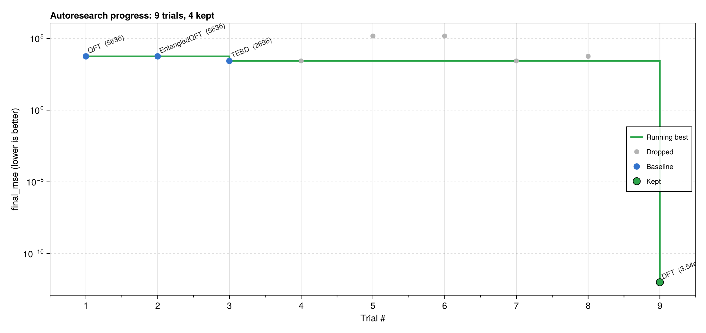
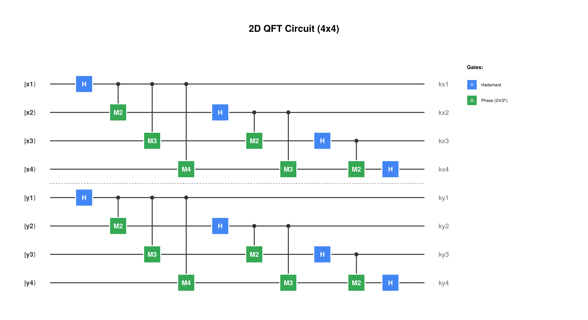

# AutoDFT.jl

A toy for studying autonomous ML research loops. An LLM agent edits
`AbstractSparseBasis` implementations over [ParametricDFT.jl](https://github.com/nzy1997/ParametricDFT.jl)
on a fixed 512×512 image compression task. A frozen evaluation surface, pinned
in `frozen-manifest.toml` and enforced by GitHub Actions, keeps the agent from
quietly moving the goalposts while it mutates basis topologies, phase gates,
or einsum wirings.

Not a compression-theory contribution. The baseline is a direct reproduction
of ParametricDFT's four built-in bases (QFT, EntangledQFT, TEBD, MERA) at
`m = n = 9` with 10% sparsity. Modeled on
[autoresearch-hubbard](https://github.com/fliingelephant/autoresearch-hubbard).

## Quick start

From a cloned repo, open Claude Code:

```bash
git clone https://github.com/zazabap/AutoDFT.jl.git
cd AutoDFT.jl
make init             # Pkg.instantiate() — pulls the pinned ParametricDFT SHA
make verify           # "frozen surface OK"
make test             # full test suite (CPU fallback on hosts without CUDA)
```

Then open an agent session:

```bash
cd AutoDFT.jl
claude   # or your agent of choice
```

In the session:

> Read program.md and start a new autoresearch experiment.

The agent takes over from `program.md`: proposes a branch tag
(`autoresearch/<tag>`), reads `best.tsv`, then loops edit → commit →
`make trial NAME=<Name>` → keep or `git reset --hard HEAD~1` until you
Ctrl+C. Each trial is ~2–10 min on GPU (the harness auto-detects CUDA via
`_default_device()` and uses `device=:gpu` when available). Per `program.md`,
the agent will not pause to ask — you are the kill switch.

## Unattended run on a server

Claude refuses `bypassPermissions` under `root`, so create a non-root user
first (re-install Julia / `claude` for them if needed):

```bash
useradd -m -s /bin/bash agent
chown -R agent:agent /workspace/AutoDFT.jl
su - agent
cd /workspace/AutoDFT.jl
CUDA_VISIBLE_DEVICES=1 CLAUDE_AUTOCOMPACT_PCT_OVERRIDE=28 \
    claude --permission-mode bypassPermissions
```

`CUDA_VISIBLE_DEVICES=1` pins training to GPU 1 so the default GPU stays free
for interactive use. `--permission-mode bypassPermissions` removes approval
prompts. `CLAUDE_AUTOCOMPACT_PCT_OVERRIDE=28` makes the session auto-compact
earlier so the loop can keep iterating through many more experiments.

## What the experiment does

- **Fixture**: 512×512 Float64 image, band-limited Gaussian random field
  (`Random.seed!(42)`, low-pass bandwidth 32, ~3208 nonzero Fourier
  coefficients). Committed verbatim as `data/fixture_512.bin`.
- **Sparsity**: `k = 26_214` (10% of 2^18 coefficients) — top-k magnitude
  truncation, basis-agnostic.
- **Training budget**: 500 steps of `RiemannianAdam(lr=0.01)`, batch size 1,
  seed 42, no validation split, no early stopping.
- **Metric**: `final_mse = loss_function(trained_basis, fixture, MSELoss(k))`
  — reconstruction L2 error after forward → topk → inverse. Lower is better.
- **Baselines** (`make baseline`): QFT, EntangledQFT, TEBD. (MERA excluded
  because ParametricDFT's `mera_code` asserts `m` must be a power of 2, and
  the frozen config pins `m = 9`.)
- **Loop** (`program.md`): copy `_example_basis.jl` → `<Name>Basis.jl`,
  implement the interface, register, test, `make trial NAME=<Name>`. Keep
  the commit iff `final_mse < best * (1 - 0.01)`. Otherwise
  `git reset --hard HEAD~1` and log a dropped-trial note on a separate
  commit so the attempt survives.

## Current leader

See the scatter above for the full trial history (baselines blue, kept green,
dropped grey, log-scale `final_mse`, running-best step line). Summary:

| basis | MSE | params | note |
|---|---|---|---|
| **DFTBasis** | `3.54e-24` | 360 | true 2D DFT, `src/bases/dft_basis.jl` (kept) |
| TEBDBasis    | `2.70e+03` | 144 | baseline |
| QFTBasis     | `5.64e+03` | 360 | baseline |
| EntangledQFT | `5.64e+03` | 396 | baseline |

### Circuit structure



Rendered by `ParametricDFT.plot_circuit` at pedagogical size (m = n = 4,
8 qubits). The actual fixture is m = n = 9 (18 qubits, same structure —
see `docs/circuit_full.png` or regenerate with `scripts/plot_circuit.jl`).
Row qubits `|x_i⟩` form the row DFT, column qubits `|y_i⟩` form the column
DFT, separated by the dashed line. Blue `H` are Hadamards; green `M_k` are
controlled-phase gates with phase `2π/2^k`. This is the textbook 2D QFT —
no learnable parameters in the "correct DFT" construction.

`DFTBasis` reuses these exact tensors unchanged; the win over `QFTBasis`
comes from permuting the einsum's *input*-leg labels
(`qubit_perm = vcat(reverse(1:m), reverse(m+1:m+n))`). The Yao-emitted
circuit *is* the textbook QFT, but `reshape(img, 2, 2, ...)` feeds bits
to qubits in the opposite significance order, so without the permutation
the pipeline was computing `P · F · P` instead of `F`. The input-leg
reversal cancels the redundant `P`. See
`docs/superpowers/specs/2026-04-19-autoresearch-parametricdft-basis-design.md`
(addendum) for the full derivation and `autoresearch/initial` for the 5
dropped trials that led to this finding.

Regenerate the plots after a new trial with:

```bash
julia --project=. scripts/plot_results.jl   # writes docs/progress.png
julia --project=. scripts/plot_circuit.jl   # writes docs/circuit{,_full}.png
```

## File map

Frozen (agent cannot modify; CI rejects drift):

- `frozen-manifest.toml` — single source of truth. SHA256 of every frozen
  file, probe value, optional `[secret].manifest_sha`.
- `prepare.jl` — loads the manifest and runs `verify_frozen_surface()`.
- `src/harness/{fixture,evaluate,probe,train}.jl` — the evaluation pipeline.
- `src/AutoDFT.jl`, `src/runners.jl` — module root and `run_baseline` /
  `run_trial` entry points.
- `data/fixture_512.bin` — the 512×512 test image.
- `Project.toml`, `Manifest.toml` — pin `ParametricDFT.jl` at
  `79117aa8b584f405c0d3268a9f1b306c42337b9e`.
- `Makefile`, `program.md`, `README.md`, `LICENSE`, `.claude/`.
- `.github/workflows/CI.yml`, `.github/workflows/basis-freeze.yml`.
- `test/runtests.jl`, `test/harness_tests.jl` — top-level test driver and
  the frozen-harness regression tests (probe, interface conformance).

Editable (agent mutates freely):

- `src/bases/<Name>Basis.jl` — new bases. `src/bases/_example_basis.jl` is a
  template (leading `_` means `registry.jl` skips it on auto-discover).
- `src/bases/registry.jl` — `BASELINES` + `TRIAL_REGISTRY` + auto-discover.
- `test/bases_tests.jl` — per-basis conformance tests.
- `results.tsv` — append-only trial log.
- `best.tsv` — current leader (atomically rewritten on acceptance).
- `docs/superpowers/{specs,plans}/` — brainstorm/plan artefacts.

## Enforcement model

Three independent checks, each run in two places. The manifest SHA secret
lives outside the repo, so an agent who edits both a frozen file and its
manifest entry still fails CI.

| Check | What it catches | Local (`make verify`) | GitHub Actions (`basis-freeze`) |
|---|---|---|---|
| `sha256(<frozen file>)` for every entry in `[files]` of `frozen-manifest.toml` (22 files) | byte-level edits to any frozen file, including `prepare.jl` itself | yes | yes |
| `sha256(BASIS_FREEZE_SALT ∥ concat(sorted file SHAs))` compared to `[secret].manifest_sha` | edits to a frozen file that also rewrote the matching `[files]` entry locally | no — salt is not in the repo | yes (salt injected from `BASIS_FREEZE_SALT` repo secret) |
| `BASIS_IDENTITY_PROBE` — deterministic MSE of `QFTBasis(9,9)` on the fixture (pinned at `5636.395472862066`) | numerical drift in ParametricDFT, `topk_truncate`, or the fixture bytes (semantic changes that leave file bytes unchanged but alter output) | yes | yes |

Branch rules on `main`:
- PR required, `basis-freeze / verify` must be green.
- No force-push.
- CI matrix is Julia `1.12` and `1` (latest stable). GPU tests run only when
  a commit message contains `[gpu]` (matches ParametricDFT convention).

## Changing the frozen surface

Phases beyond the current one (different fixture, different image size,
different sparsity, re-adding MERA) require a deliberate update:

1. Edit the relevant frozen file(s) — anything under `[files]` in
   `frozen-manifest.toml`, or the constants inside `src/AutoDFT.jl`.
2. Run `make rehash` — updates the `[files]` block in the manifest and, if
   `BASIS_FREEZE_SALT` is in the env, recomputes `[secret].manifest_sha`.
3. Rotate the `BASIS_FREEZE_SALT` repo secret if the salt has leaked; the
   same salt also needs to be set in your local env for future `make rehash`
   runs.
4. Land all of the above through a reviewed PR.

## License

MIT.
